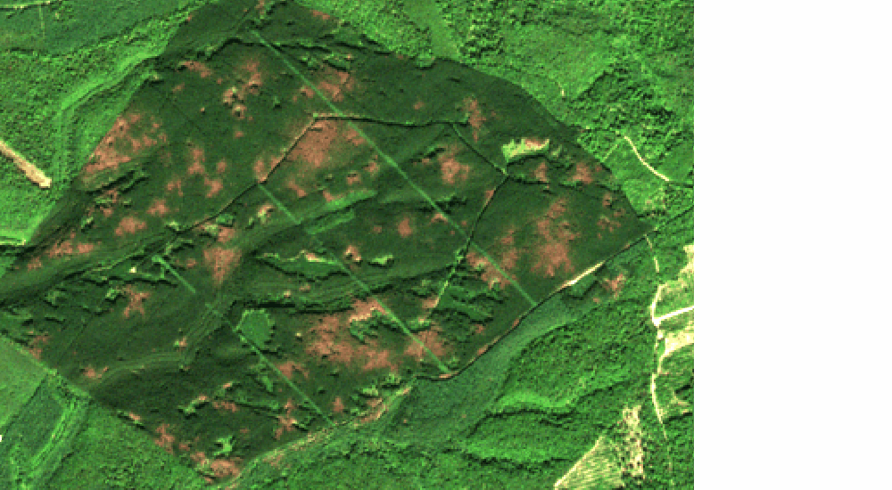

# fordead : un package python pour la détection d'anomalies de végétation à partir d'images SENTINEL-2

Le package `fordead`, développé pour la détection d'anomalies de végétation à partir de séries temporelles SENTINEL-2, fournit des outils de surveillance pour répondre à la crise sanitaire des scolytes sur les épicéas en France. Il contient de nombreux outils qui simplifient l'utilisation des données satellitaires SENTINEL-2, et qui permettent la détection éventuelle d'anomalies dans d'autres contextes. 

La méthode proposée exploite des séries temporelles complètes SENTINEL-2 et ce, depuis le lancement du premier satellite en 2015. Elle permet de détecter des anomalies à l'échelle du pixel pour analyser des données d'archives ou procéder à une surveillance continue. Les détections sont alors mises à jour à chaque nouvelle acquisition SENTINEL-2.

## Utilisation pour la détection de déperissement

La détection du dépérissement se fait en cinq, voire six étapes.
1. [Le calcul des indices de végétation et des masques pour chaque date SENTINEL-2](https://fordead.gitlab.io/fordead_package/docs/user_guides/french/01_compute_masked_vegetationindex/)
2. [L'apprentissage par modélisation de l'indice de végétation pixel par pixel à partir des premières dates](https://fordead.gitlab.io/fordead_package/docs/user_guides/french/02_train_model/)
3. [La détection du déperissement par comparaison entre l'indice de végétation prédit par le modèle et l'indice de végétation réel](https://fordead.gitlab.io/fordead_package/docs/user_guides/french/03_dieback_detection/)
4. [La création du masque forêt, qui définit les zones d'intérêt](https://fordead.gitlab.io/fordead_package/docs/user_guides/french/04_compute_forest_mask/)
5. [L'export de sorties permettant de visualiser les résultats au pas de temps souhaité](https://fordead.gitlab.io/fordead_package/docs/user_guides/french/05_export_results/)

> **N.B.** Il est possible de corriger l'indice de végétation à l'aide d'un facteur de correction calculé à partir de la médiane de l'indice de végétation des peuplements d'intérêt à large échelle, auquel cas l'étape de création du masque doit être réalisée avant l'étape d'apprentissage du modèle.

L'ensemble de la documentation, dont les guides utilisateurs de ces étapes, est disponible sur le [site](https://fordead.gitlab.io/fordead_package/).

Voici un exemple de résultat sur une zone atteinte par le scolyte :

Période de détection | Classe de confiance
:-------------------------:|:-------------------------:
 | 

## Outils de visualisation

Le package contient également des outils de visualisation. 

Le premier outil réalise un graphique de la série temporelle de l'indice de végétation pour un pixel en particulier, avec le modèle associé, le seuil de détection d'anomalies et la détection associée.

Pixel sain | Pixel atteint
:-------------------------:|:-------------------------:
 | 

Le deuxième outil réalise un "timelapse" sur une petite zone pour visualiser l'évolution des résultats à chaque date SENTINEL-2 utilisée, avec en fond des compositions "couleurs naturelles" (RVB) SENTINEL-2. Un curseur permet en outre de naviguer entre les dates. 

## Installation

Le guide d'installation est disponible [ici](https://fordead.gitlab.io/fordead_package/docs/Installation/).

## Tutoriel

Un tutoriel pour bien commencer et, tester le package sur un jeu de données fourni, est disponible [ici](https://fordead.gitlab.io/fordead_package/docs/Tutorials/Dieback_Detection/00_Intro/).
