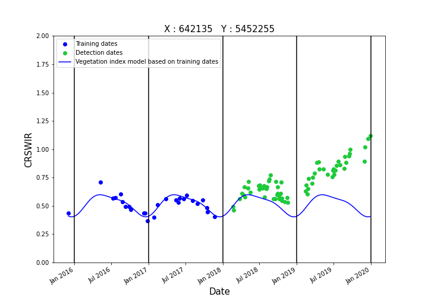

#### Step 2 : Definition of pixelwise seasonality based on a harmonic model

A harmonic model is adjusted for each pixel based on a time period defined by user, considered as representative of a 'normal' seasonal behavior of the vegetation index.
The parameterization of the model is influenced by many factors, such as forest density, composition, topography. 
Since this seasonality is relatively variable among pixels, even within an individual forest stand, seasonality is set at the pixel level to account for these differences. 
The periodic model adjusted over the training period is expressed as follows:
```math
a1 + b1\sin{\frac{2\pi t}{T}} + b2\cos{\frac{2\pi t}{T}} + b3\sin{\frac{4\pi t}{T}} + b4\cos{\frac{4\pi t}{T}}
```

The following figure illustrates a time series corresponding to CRSWIR for a single pixel based on unmasked Sentinel-2 acquisitions, and the corresponding periodic model adjusted from acquisitions covering the training period:



Comprehensive documentation of this step can be found [here](https://fordead.gitlab.io/fordead_package/docs/user_guides/english/02_train_model/).

##### Running this step using a script

Run the following instructions to perform this processing step:
```python
from fordead.steps.step2_train_model import train_model

train_model(data_directory = data_directory, 
            nb_min_date = 10, 
            min_last_date_training="2018-01-01", 
            max_last_date_training="2018-06-01")
```

##### Running this step from the command prompt

This procesing step can also be performed from a terminal:

```bash
fordead train_model -o <output directory> --nb_min_date 10 --min_last_date_training 2018-01-01 --max_last_date_training 2018-06-01
```
Here, the model is adjusted based on all Sentinel-2 acquisitions from the first acquisition to the last acquisition before 2018-01-01. 
If less than 10 valid acquisitions are available on 2018-01-01, additional acquisitions are used in order to reach 10 valid acquisitions, unless this number is not reach on 2018-06-01. 
In this situation, the pixel is discarded and no seasonality model is adjusted.
This allows, for example in the case of a relatively ancient source of anomalies such as the bark beetle crisis, to start the detection as early as 2018 if there are enough valid dates at the beginning of the year, while allowing the study of pixels in situations with less data available simply by performing the training over a longer period to retrieve other valid dates. 

It is not recommended to end the training before 2018, as a minimum of two seasons of SENTINEL-2 acquisitions is required to adjust the model.

> **_NOTE :_** This step can also be performed if user provides already computed vegetation index time series and corresponding mask: the parameters **path_vi** and **path_masks** correspond to the directories where the spectral index and corresponding mask are stored.
Here again, the process is bypassed if the model is already computed and no parameters were changed. 
If some parameters were changed, previous results from this step and subsequent steps are deleted and the model is computed.

##### Outputs

The outputs of this processing step are described hereafter :
- **DataModel** directory :
    - **first_detection_date_index.tif** refers to a raster file containing the index of the first acquisition used for detection. 
	It allows to know which dates are used for training for each pixel, and which ones are used for detection.
    - **coeff_model.tif** is a raster stack including 5 layers, one for each coefficient of the vegetation index model.
- **ForestMask** directory: the binary raster **valid_area_mask.tif** is written. This mask identifies valid pixels for which a model was computed as 1, and non-valid pixels as 0.


[NEXT PAGE](https://fordead.gitlab.io/fordead_package/docs/Tutorial/03_dieback_detection)
