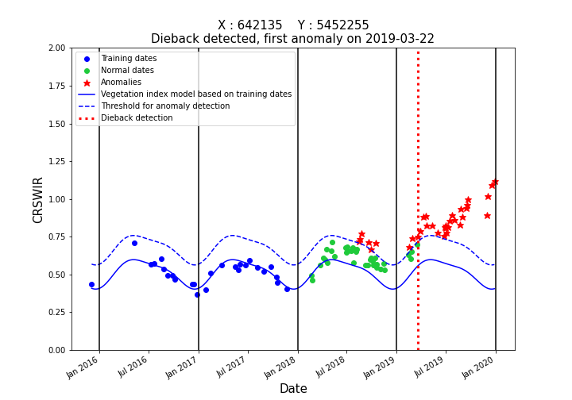

#### Step 3 : Detecting anomalies by comparing the vegetation index and its predicted value

The value of the vegetation index is compared to the vegetation index predicted from the periodic model calculated in the previous step, for each SENTINEL-2 acquisition available for the detection step.
An anomaly is identified when the difference exceeds a threshold (in the expected direction in case of anomaly). 
For example, the CRSWIR is sensitive to canopy water content and tends to increase with decreasing water content. 
Bark beetle outbreaks induce decreasing canopy water content, therefore only CRSWIR values higher than expected values can be identified as anomalies. 
The anomaly is reported for a pixel when three successive anomalies are detected. 
This prevents from false positive corresponding to one time events of anomalies due to an imperfect mask, or temporary climatic events. 

Once anomalies confirmed (after three successive anomalies), pixel can return to normal state if no anomaly is detected for three successive acquisitions. 
This reduces the risk of false positive corresponding to long drought periods resulting in more than three successive anomalies.

As an example, the following figure shows the time series of the vegetation index along with the threshold for anomaly detection, and the date of detection :




Comprehensive documentation can be found [here](https://fordead.gitlab.io/fordead_package/docs/user_guides/english/03_dieback_detection/).

##### Running this step using a script

Run the following instructions to perform this processing step:
```python
from fordead.steps.step3_dieback_detection import dieback_detection

dieback_detection(data_directory = data_directory, 
                  threshold_anomaly = 0.16)
```

##### Running this step from the command prompt

This processing step can also be performed from a terminal:
```bash
fordead dieback_detection -o <output directory> --threshold_anomaly 0.17
```
> **_NOTE :_** As always, if the model is already computed and no parameters were changed, the process is ignored. If parameters were changed, previous results from this step and subsequent steps are deleted and the model is computed anew.

##### Outputs

The outputs of this step, in the data_directory folder, are :
- In the **DataDieback** folder, three rasters:
    - **count_dieback** is the number of successive dates with anomalies
    - **first_date_dieback** is the index of the first date with an anomaly in the last series of anomalies
    - **state_dieback** is a binary raster with pixel as suffering from dieback (at least three successive anomalies) identified as 1.
- In the **DataAnomalies** folder, a raster for each date **Anomalies_YYYY-MM-DD.tif** whose value is 1 where anomalies are detected.


[NEXT PAGE](https://fordead.gitlab.io/fordead_package/docs/Tutorial/04_compute_forest_mask)
