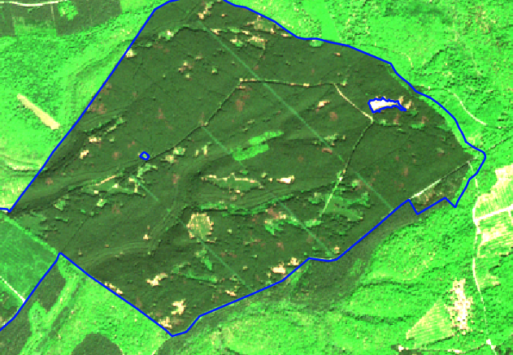
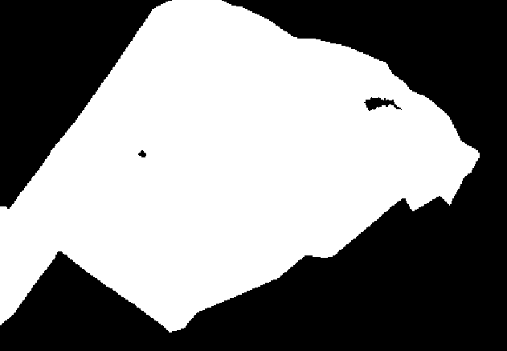

#### Step 4 : Creating a forest mask, which defines the areas of interest

The previous steps compute results on every pixel, but to export results, it will become necessary to restrict the area of study to the vegetation of interest, in our case resinous forests. This steps aims at computing and saving a binary raster which will then be used to filter out pixels outside of these areas of interest. This can be done using a vector, which will be rasterized, or a binary raster which will be clipped but still needs to have the same resolution, and be aligned with the Sentinel-2 data. Also no mask can be used, in which case results are unfiltered. Other options are tied to data specific to France, using IGN's BDFORET or CESBIO's OSO map.

In this tutorial, we will use a vector shapefile, available with the example dataset, whose polygons will be rasterized as a binary raster.

The complete guide can be found [here](https://fordead.gitlab.io/fordead_package/docs/user_guides/english/04_compute_forest_mask/).

Study area with area of interest             |  Resulting mask
:-------------------------:|:-------------------------:
  |  

##### Running this step using a script

To run this step, simply add the following lines to the script :
```python
from fordead.steps.step4_compute_forest_mask import compute_forest_mask
compute_forest_mask(data_directory, forest_mask_source = "vector", vector_path = "<MyWorkingDirectory>/vector/area_interest.shp")
```

##### Running this step from the command invite

This step can also be used from the command invite with the command :
```bash
fordead forest_mask -o <output directory> -f vector --vector_path <MyWorkingDirectory>/vector/area_interest.shp
```
##### Outputs

The outputs of this fourth step, in the data_directory folder, are :
- In the folder ForestMask, the binary raster Forest_Mask.tif which has the value 1 on the pixels of interest and 0 elsewhere.

> **_NOTE :_** Though this step is presented as the fourth, it can actually be used at any point, even on its own in which case the parameter **path_example_raster** is needed to give a raster from which to copy the extent, resolution, etc...

[NEXT PAGE](https://fordead.gitlab.io/fordead_package/docs/Tutorial/05_compute_confidence)