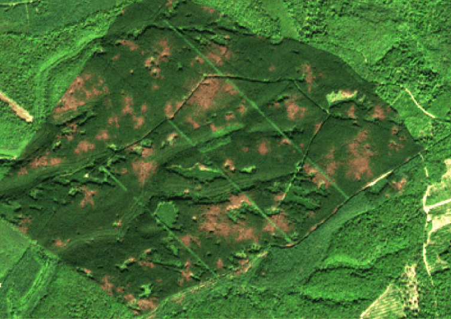

#### (OPTIONAL) Step 5 : Computing a confidence index to classify anomalies by severity

This step is completely optional and aims at computing a confidence index whose value goes up as the registered anomalies increase in severity, thus it can be used to describe the intensity of the detected disturbance and possibly help to filter out potential false detections.  
The index is a weighted mean of the difference between the vegetation index and the predicted vegetation index for all unmasked dates after the first anomaly subsequently confirmed. For each date used, the weight corresponds to the number of unmasked dates from the first anomaly. In case of a disturbance, the intensity of anomalies often goes up which is why later dates have more weight. Since all Sentinel-2 dates are used, this index describes the state of the pixel at the last used Sentinel-2 date, and not the state at the moment of detection. The following picture illustrates the confidence index formula :


Then, pixels are classified into classes, based on the discretization of the confidence index using a list of thresholds. Pixels with only three anomalies are classified as the lowest class, because 3 anomalies might not be enough to calculate a meaningful index. The results are vectorized.

This step's complete guide can be found [here](https://fordead.gitlab.io/fordead_package/docs/user_guides/english/05_compute_confidence/).

##### Running this step using a script

To run this step, simply add the following lines to the script :
```python
from fordead.steps.step5_compute_confidence_index import compute_confidence_index
compute_confidence_index(data_directory, threshold_list = [0.265], classes_list = ["Low anomaly", "Severe anomaly"])
```

##### Running this step from the command invite

This step can also be used from the command invite with the command :
```bash
fordead ind_conf -o <output directory> -t 0.265 -c "Low anomaly" -c "Severe anomaly"
```

##### Outputs

The outputs of this fourth step, in the data_directory/Confidence_Index folder, are :
- confidence_class.shp, the vectorized classification results in shapefile format, where pixels are grouped as polygons by class
- confidence_index.tif, the raster containing the continous confidence index value
- nb_dates.tif, the raster containing the number of unmasked dates since the first confirmed anomaly for each pixel

The following illustration shows the Sentinel-2 view, as well as the continuous confidence index raster, and then the discretized, vectorized confidence class for this example's detection. The Sentinel-2 date shown is the last date available (2019-09-20), since the confidence index shows the detected state of pixels at the last Sentinel-2 date used.



> **_NOTE :_** If the confidence index was already calculated, you change the threshold list or classes list and it will simply import the results of the previous process. But if new Sentinel-2 dates were added, the step will compute the confidence index and erase previous results.

[NEXT PAGE](https://fordead.gitlab.io/fordead_package/docs/Tutorial/06_export_results)
