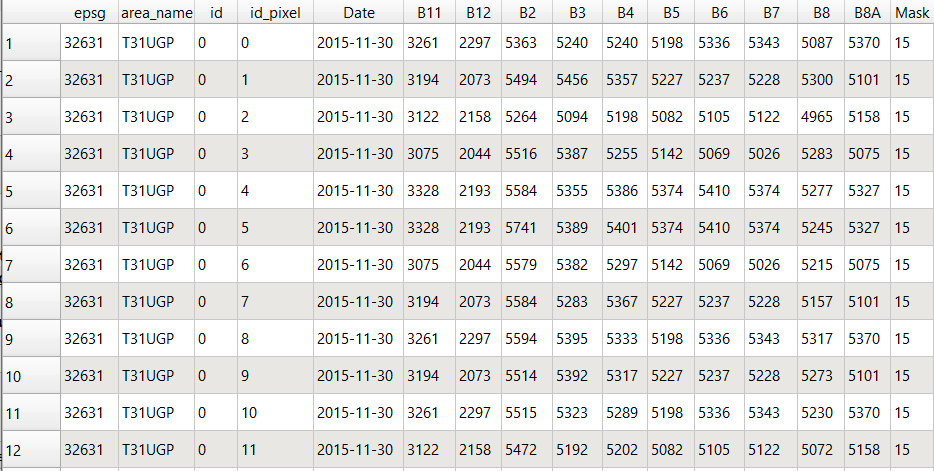

# <div align="center"> Extraction of reflectance from Sentinel-2 data </div>

The vector file created in the previous step is used to extract reflectance from Sentinel-2 data.

##### Running this step using a script

Run the following instructions to extract reflectance corresponding to datapoints saved in **preprocessed_obs_path** from Sentinel-2 time series.
First make sure that the directory defined in the **export_path** variable exists.

```python
from fordead.validation.extract_reflectance import extract_reflectance

extracted_reflectance_path = "<MyWorkingDirectory>/extracted_reflectance.csv"

extract_reflectance(
	obs_path = preprocessed_obs_path,
	sentinel_dir = sentinel_dir, 
	export_path = extracted_reflectance_path,
	name_column = "id")

```

##### Running this step from the command invite

This step can also be ran from the command prompt. 
```bash
fordead extract_reflectance --obs_path <MyWorkingDirectory>/vector/preprocessed_obs_tuto.shp --sentinel_dir <MyWorkingDirectory>/sentinel_data/validation_tutorial/sentinel_data/ --export_path <MyWorkingDirectory>/extracted_reflectance.csv --name_column id
```

The command `fordead extract_reflectance -h` will print the help information of this step. For example, to use it with the same parameters, the following command can be used:

The csv written in **export_path** includes the following attributes corresponding to the different pixels : 
- epsg: 
- area_name: Sentinel-2 tile ID when available
- id: 
- id_pixel:
- Date: date of acquisition
- B2-B11: reflectance extracted from Sentinel-2 data for the corresponding pixel [sort by increasing wavelength: B2-B11, not B11-B8A]
- Mask: 



The file will not be overwritten if the process is re-run with the same data.
New Sentinel-2 acquisitions or ground observations will be appended to the file if added to the input data. 

The update procedure can be tested with additional Sentinel-2 data located in **<MyWorkingDirectory>/validation_tutorial/sentinel_data_update**:
copy and paste this additional data to the sentinel_data directory and run this step again.

** need an additional example to test what happens hen adding polygons **

[PREVIOUS PAGE](https://fordead.gitlab.io/fordead_package/docs/Tutorials/Validation/01_preprocessing_observations)

