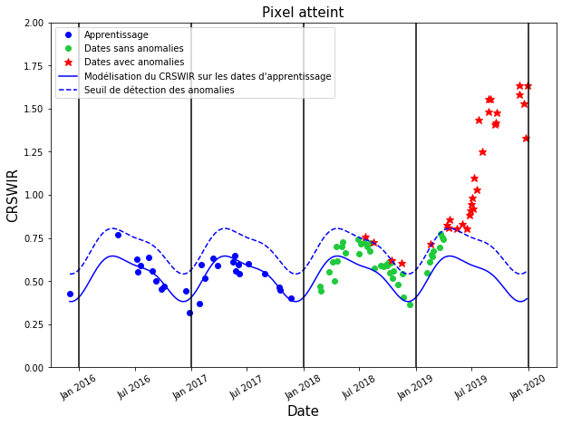

# Visualisation des résultats
Le package contient également deux outils de visualisation des résultats. Le premier permet de réaliser un timelapse permettant de visualiser les résultats à chaque date Sentinel-2 utilisée, avec en fond les données Sentinel-2 en RGB, avec un slider pour naviguer entre les différentes dates.
Le deuxième permet de visualiser pour un pixel en particulier la série temporelle de l'indice de végétation avec le modèle associé, le seuil de détection d'anomalies et les détections associées.

## Créer des timelapses
#### ENTRÉES
Les paramètres en entrée sont :

- **data_directory** : Le chemin du dossier dans lequel sont écrits les résultats déjà calculés, et dans lequel seront sauvegardés les timelapses
- **obs_terrain_path** : Optionnel, chemin du shapefile contenant les observations terrain, avec les colonnes "scolyte1", "organisme" et "date". "scolyte1" peut prendre les valeurs  "C", "V", "R", "S", "I", "G" ou "X".
- **shape_path** : Chemin d'un shapefile contenant des polygones ou des points utilisés pour définir la zone des timelapses
- **coordinates** : Couple de valeurs x,y, dans le système de projection de la tuile, utilisés pour définir la zone du timelapse. (format : `(x,y)`)
- **buffer** : Longueur utilisée pour étendre la zone du timelapse à partir des points ou des polygones.
- **name_column** : Nom de la colonne contenant l'identifiant ou nom unique du polygone ou point si **shape_path** est utilisé. (Par défault : "id")

Les paramètres indispensables sont **data_directory** ainsi que **shape_path** ou **coordinates**.

#### SORTIES
Les sorties sont dans le dossier data_directory/Timelapses, avec pour chaque polygone ou point un fichier .html avec comme nom de fichier la valeur dans la colonne **name_column** si réalisés à partir de **shape_path**, ou x_y.html si réalisé à partir de coordonnées.

Cet outil peut ne pas fonctionner sur des zones trop larges, il est recommandé d'éviter de lancer cette opération sur des zones de plus d'une vingtaine de km².

#### ANALYSE
Le slider permet de se déplacer temporellement de date SENTINEL en date SENTINEL
L'image correspond aux bandes RGB des données SENTINEL
Les résultats apparaissent sous forme de polygones :
- Polygones noirs : sol nu
- Polygones jaunes : zones détectées comme dépérissantes
- Polygones bleus : zones détectées comme coupe sanitaire (zones détectées comme sol-nu après avoir été détectées comme dépérissantes)

Les résultats apparaissent à partir de la première anomalie, confirmée par la suite. Les fausses détections liées à un stress hydrique temporaire et corrigées par la suite n'apparaissent pas. De même, pour les dernières , il peut y avoir des anomalies n'apparaissant pas encore par manque de  valides pour confirmer la détection.

Si les données d'observation sur le terrain sont également affichées, passer la souris sur ces polygones pour obtenir leurs informations :  | <organisme à l'origine de la donnée> : <date d'observation>. La couleur dépend du stade observé.
Il est également possible de zoomer sur la zone souhaitée en maintenant le clique appuyé tout en délimitant une zone. Il est ensuite possible de dézoomer en double cliquant sur l'image. Passer la souris sur un pixel permet également d'obtenir ses informations :

x : coordonnées en x
y : coordonnées en y
z : [<réflectance dans le rouge>,<réflectance dans le vert>,<réflectance dans le bleu>], c'est à dire la valeur de la bande SENTINEL correspondante à la date donnée.

## Utilisation
### A partir d'un script
#### A partir d'un shapefile contenant les zones d'intérêt
```bash
from fordead.visualisation.create_timelapse import create_timelapse
create_timelapse(data_directory = <data_directory>,shape_path = <shape_path>, buffer = 100, name_column = "id")
```
#### A partir de coordonnées
```bash
from fordead.visualisation.create_timelapse import create_timelapse
create_timelapse(data_directory = <data_directory>,coordinates = (x,y), buffer = 100)
```
### A partir de l'invité de commande
```bash
fordead timelapse [OPTIONS]
```
Voir documentation détaillée sur le [site](https://fordead.gitlab.io/fordead_package/docs/cli/#fordead-timelapse)

## Créer des graphes montrant l'évolution de la série temporelle
#### ENTRÉES
Les paramètres en entrée sont :
data_directory, shape_path = None, ymin = 0, ymax = 2, chunks = None

- **data_directory** : Le chemin du dossier dans lequel sont écrits les résultats déjà calculés, et dans lequel seront sauvegardés les graphes
- **shape_path** : Chemin d'un shapefile contenant les points où les graphiques seront réalisés.
- **name_column** : Nom de la colonne contenant l'identifiant ou nom unique du point (Par défaut : "id")
- **ymin** : ymin limite du graphe, à adapter à l'indice de végétation utilisé (Par défaut : 0)
- **ymax** : ymax limite du graphe, à adapter à l'indice de végétation utilisé (Par défaut : 2)
- **chunks** : int, Si les résultats utilisés ont été calculés à large échelle, donner une taille de chunks (ex : 1280) permet d'importer les données de manière à sauvegarder la RAM. 

#### SORTIES
Les sorties sont dans le dossier data_directory/SeriesTemporelles, avec pour chaque point un fichier .png avec comme nom de fichier la valeur dans la colonne **name_column**.


## Utilisation
### A partir d'un script
#### A partir d'un shapefile contenant les zones d'intérêt
```bash
from fordead.visualisation.vi_series_visualisation import vi_series_visualisation
vi_series_visualisation(data_directory = <data_directory>, shape_path = <shape_path>, name_column = "id", ymin = 0, ymax = 2, chunks = 100)
```
#### A partir de coordonnées
```bash
from fordead.visualisation.vi_series_visualisation import vi_series_visualisation
vi_series_visualisation(data_directory = <data_directory>, ymin = 0, ymax = 2, chunks = 100)
```
Dans ce mode, l'utilisateur peut choisir de donner des coordonnées X et Y dans le système projection des données Sentinel-2 utilisées.
Il est également possible de donner l'indice du pixel en partant du (xmin,ymax), utile si un timelapse a été crée sur l'ensemble de la zone calculé auquel cas l'indice correspond aux coordonnées dans le timelapse.

### A partir de l'invité de commande
```bash
fordead graph_series [OPTIONS]
```
Voir documentation détaillée sur le [site](https://fordead.gitlab.io/fordead_package/docs/cli/#fordead-graph_series)

#### EXEMPLE

