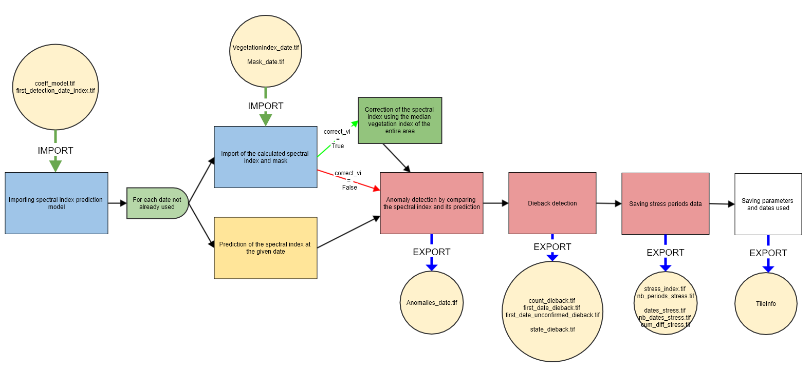

## STEP 3: Detection of forest disturbance by comparing the model-predicted vegetation index with the actual vegetation index
This step allows the detection of forest disturbance. For each SENTINEL date not used for training, the actual vegetation index is compared to the vegetation index predicted from the model calculated in the previous step. If the difference exceeds a threshold, an anomaly is detected. If three successive anomalies are detected, the pixel is considered as declining. If after being detected as declining, the pixel has three successive dates without anomalies, it is no longer considered as declining.

#### INPUTS
The input parameters are :
- **data_directory**: The path of the output folder where the detection results will be written.
- **threshold_anomaly**: Threshold at which the difference between the actual and predicted vegetation index is considered as an anomaly
- **vi**: Vegetation index used, it is not necessary to fill it in if the [_compute_masked_vegetationindex_](https://fordead.gitlab.io/fordead_package/docs/user_guides/english/01_compute_masked_vegetationindex/) step has been used.
- **path_dict_vi** : Path to a text file allowing to add usable vegetation indices. If not filled in, only the indices provided in the package are usable (CRSWIR, NDVI, NDWI). The file [examples/ex_dict_vi.txt](/examples/ex_dict_vi.txt) gives an example on how to format of this file. It is necessary to fill in its name, its formula, and "+" or "-" depending on whether the index's value increases or decreases in case of forest disturbances. It is also not necessary to fill it in if it has been done previously in the [_compute_masked_vegetationindex_] step (https://fordead.gitlab.io/fordead_package/docs/user_guides/english/01_compute_masked_vegetationindex/).

#### OUTPUTS
The outputs of this step, in the data_directory folder, are :
- In the **DataDecline** folder, three rasters:
    - **count_decline** : the number of successive dates with anomalies
    - **first_date_decline**: The index of the first date with an anomaly in the last series of anomalies
    - **state_decline**: A binary raster whose value is 1 if the pixel is detected as declining (at least three successive anomalies)
- In the **DataAnomalies** folder, a raster for each date **Anomalies_YYYY-MM-DD.tif** whose value is 1 where anomalies are detected.

## How to use
### From a script

```bash
from fordead.steps.step3_decline_detection import decline_detection
decline_detection(data_directory = <data_directory>)
```

### From the command line
```bash
fordead decline_detection [OPTIONS]
```
See detailed documentation on the [site](https://fordead.gitlab.io/fordead_package/docs/cli/#fordead-decline_detection)

## How it works



### Importing information on previous processes and deleting obsolete results if they exist
The informations about the previous processes are imported (parameters, data paths, used dates...). If the parameters used have been modified, all the results from this step onwards are deleted. Thus, unless the parameters have been modified or this is the first time this step is performed, the detection of forest disturbance is updated using only with the new SENTINEL dates.
> **_Functions used:_** [TileInfo()](https://fordead.gitlab.io/fordead_package/reference/fordead/import_data/#tileinfo), TileInfo class methods [import_info()](https://fordead.gitlab.io/fordead_package/reference/fordead/import_data/#import_info), [add_parameters()](https://fordead.gitlab.io/fordead_package/reference/fordead/import_data/#add_parameters), [delete_dirs()](https://fordead.gitlab.io/fordead_package/reference/fordead/import_data/#delete_dirs)

### Importing the results of the previous steps
The coefficients of the vegetation index prediction model are imported, as well as the array containing the index of the first date used for the detection. The arrays containing the information related to the detection of forest disturbances (state of the pixels, number of successive anomalies, index of the date of the first anomaly) are initialized if the step is used for the first time, or imported if it is an update of the detection.
> **_Functions used:_** [import_coeff_model()](https://fordead.gitlab.io/fordead_package/reference/fordead/import_data/#import_coeff_model), [import_first_detection_date_index()](https://fordead.gitlab.io/fordead_package/reference/fordead/import_data/#import_first_detection_date_index), [initialize_decline_data()](https://fordead.gitlab.io/fordead_package/reference/fordead/import_data/#initialize_decline_data), [import_decline_data()](https://fordead.gitlab.io/fordead_package/reference/fordead/import_data/#import_decline_data)

### For each date not already used for decline detection:

#### Import of the calculated vegetation index and the mask
> **_Functions used:_** [import_masked_vi()](https://fordead.gitlab.io/fordead_package/reference/fordead/import_data/#import_masked_vi)

### (OPTIONAL - if **correct_vi** is True in [previous model calculation step](https://fordead.gitlab.io/fordead_package/docs/user_guides/03_train_model/) Correction of the vegetation index using the median vegetation index of the unmasked pixels of interest across the entire area
- Masking of the pixels not belonging to the area of interest, or masked
- Calculation of the median vegetation index on the remaining pixels of the whole area
- Calculation of a correction term, by difference between the calculated median and the prediction of the model calculated during the previous step from the median calculated for all the dates
- Application of the correction term by adding it to the value of the vegetation index of every pixel
> **_Functions used:_** [correct_vi_date()](https://fordead.gitlab.io/fordead_package/reference/fordead/model_spectral_index/#correct_vi_date)

#### Prediction of the vegetation index at the given date.
The vegetation index is predicted from the model coefficients.
> **_Functions used:_** [prediction_vegetation_index()](https://fordead.gitlab.io/fordead_package/reference/fordead/decline_detection/#prediction_vegetation_index)

#### Anomaly detection
Anomalies are detected by comparing the vegetation index with its prediction. Knowing whether the vegetation index is expected to increase or decrease in case of a disturbance, anomalies are detected where the difference between the index and its prediction is greater than **threshold_anomaly** in the direction of expected change in case of a disturbance.
> **_Functions used:_** [detection_anomalies()](https://fordead.gitlab.io/fordead_package/reference/fordead/decline_detection/#detection_anomalies)

#### Detection of forest disturbance
The successive anomalies are counted, the pixel is considered declining if there are three successive anomalies. If the pixel is considered as declining, the successive dates without anomalies are counted instead, and the pixel is not considered as declining anymore if there are three successive dates without anomalies, 
> **_Functions used:_** [detection_decline()](https://fordead.gitlab.io/fordead_package/reference/fordead/decline_detection/#detection_decline)

 ### Writing the results
The information related to the detection of forest disturbance is written. All parameters, data paths and dates used are also saved.
> **_Functions used:_** [write_tif()](https://fordead.gitlab.io/fordead_package/reference/fordead/writing_data/#write_tif),